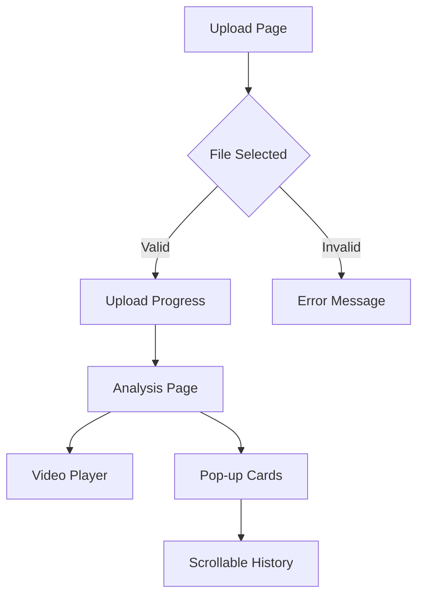

## 1. Product Overview
A web-based video analysis platform that allows users to upload videos and receive real-time coaching feedback displayed in stacked pop-up cards. The platform combines video playback with expert analysis to help users improve their technique.

Target users include athletes, coaches, and fitness enthusiasts who want detailed feedback on their performance through video analysis.

## 2. Core Features

### 2.1 User Roles
| Role | Registration Method | Core Permissions |
|------|---------------------|------------------|
| Visitor | No registration required | Upload videos, view analysis |
| Registered User | Email registration | Save videos, access history, premium features |

### 2.2 Feature Module
The video analysis platform consists of the following main pages:
1. **Upload page**: Drag-and-drop upload area, file selection, upload progress indicator.
2. **Analysis page**: Video player with controls, stacked pop-up cards showing analysis, timeline with thumbnails.

### 2.3 Page Details
| Page Name | Module Name | Feature description |
|-----------|-------------|---------------------|
| Upload page | Upload area | Drag and drop video files or click to browse. Support MP4, MOV formats up to 100MB. |
| Upload page | Progress indicator | Show upload percentage, estimated time remaining, cancel option. |
| Analysis page | Video player | Play/pause controls, timeline scrubber, volume control, fullscreen toggle. |
| Analysis page | Pop-up cards | Display coaching tips with timestamps, titles, and detailed instructions. New cards appear at top, older cards become scrollable. |
| Analysis page | Timeline thumbnails | Show video timeline with clickable thumbnails and time markers. |
| Analysis page | Tab navigation | Switch between "Notes" and "Moves" analysis views. |

## 3. Core Process
**User Flow:**
1. User lands on upload page and selects video file
2. System processes upload and displays progress
3. After upload, user is redirected to analysis page
4. Video plays automatically with analysis cards appearing in real-time
5. User can pause video and read detailed coaching tips
6. New analysis cards stack on top, pushing older cards down for scrolling

## 4. User Interface Design

### 4.1 Design Style
- **Primary colors**: Dark background (#1a1a1a) with teal accents (#00d4aa)
- **Secondary colors**: Orange/yellow (#ff9500) for different card types
- **Button style**: Rounded rectangles with subtle shadows, teal border on active state
- **Font**: Sans-serif, clean and modern (Inter or similar)
- **Font sizes**: Large for titles (24px), medium for body text (16px), small for timestamps (12px)
- **Layout**: Split-screen with video on left (60%), analysis cards on right (40%)
- **Card style**: Rounded corners (12px radius), subtle drop shadows, timestamp badges with pill shape

### 4.2 Page Design Overview
| Page Name | Module Name | UI Elements |
|-----------|-------------|-------------|
| Upload page | Upload area | Large dashed border box with cloud upload icon, "Drag video here or click to browse" text, file format and size limits displayed below. |
| Analysis page | Video player | Dark video player with teal accent controls, timeline at bottom with thumbnail previews, current time display. |
| Analysis page | Pop-up cards | Stacked cards with white background, timestamp badges (teal for coaching tips, orange for moves), bold titles, multi-line instructional text with proper line breaks. |
| Analysis page | Tab navigation | Horizontal tabs at top-right, "Notes" in gray (inactive), "Moves" in teal with underline (active). |

### 4.3 Responsiveness
Desktop-first design approach with mobile responsiveness. Video player maintains 16:9 aspect ratio. Pop-up cards stack vertically on smaller screens with horizontal scrolling for timeline thumbnails. Touch-optimized controls for mobile devices.