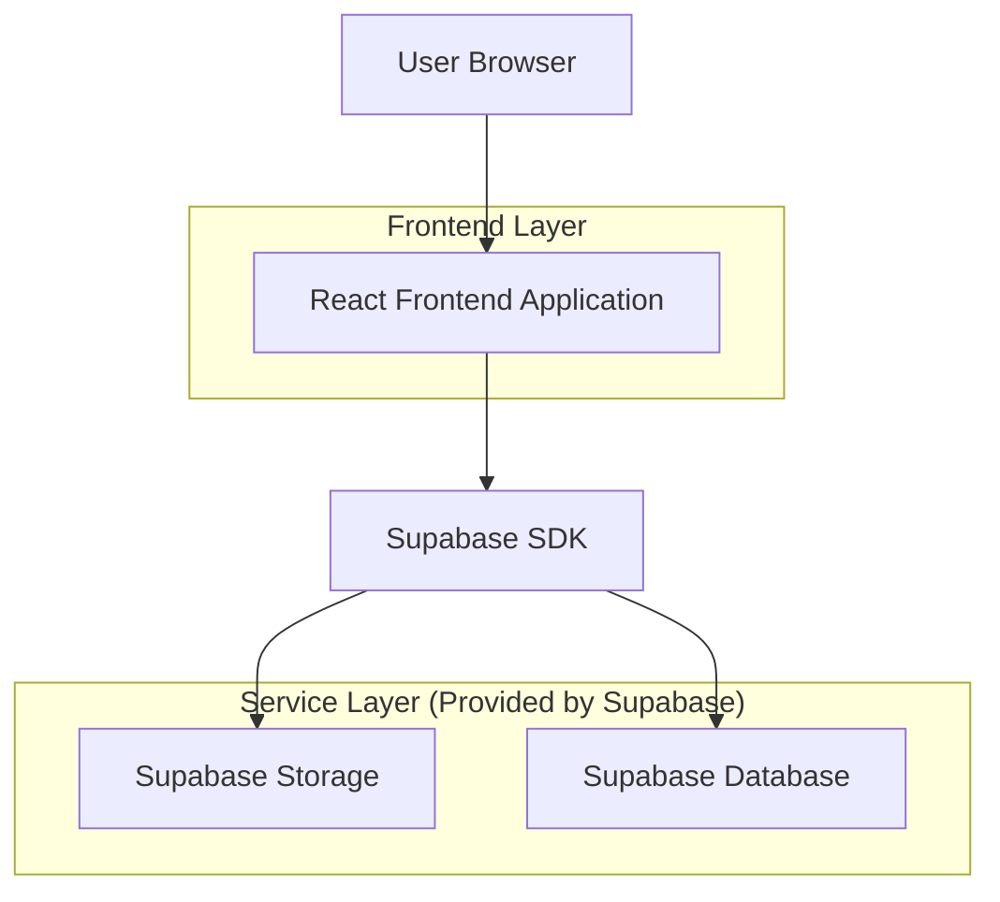
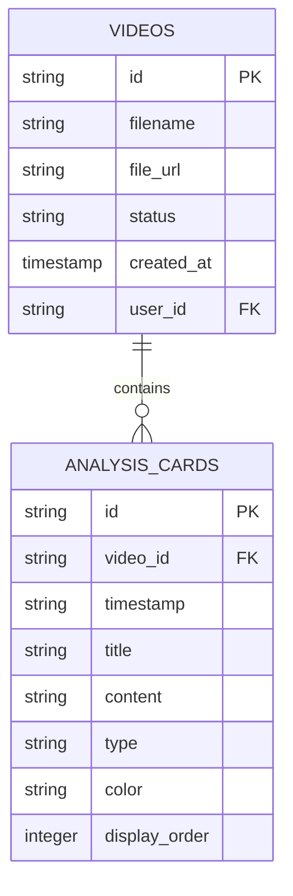

## 1. Architecture design



## 2. Technology Description

- **Frontend**: React@18 + tailwindcss@3 + vite
- **Initialization Tool**: vite-init
- **Backend**: Supabase (Storage + Database)
- **Video Processing**: Browser-based video preview and analysis simulation

## 3. Route definitions

| Route | Purpose |
|-------|---------|
| / | Upload page, main landing with video upload functionality |
| /analyze/:videoId | Analysis page, displays video player and coaching analysis cards |
| /login | Login page, optional user authentication |

## 4. API definitions

### 4.1 Core API

Video upload endpoint
```
POST /api/videos/upload
```

Request (multipart/form-data):
| Param Name| Param Type  | isRequired  | Description |
|-----------|-------------|-------------|-------------|
| video     | File        | true        | Video file (MP4, MOV, max 100MB) |
| userId    | string      | false       | Optional user ID for registered users |

Response:
| Param Name| Param Type  | Description |
|-----------|-------------|-------------|
| videoId   | string      | Unique video identifier |
| uploadUrl | string      | Direct upload URL to Supabase |
| status    | string      | Upload status |

Example response:
```json
{
  "videoId": "vid_123abc",
  "uploadUrl": "https://storage.supabase.com/videos/vid_123abc",
  "status": "processing"
}
```

### 4.2 Analysis API

Get video analysis data
```
GET /api/videos/:videoId/analysis
```

Response:
| Param Name| Param Type  | Description |
|-----------|-------------|-------------|
| analysis  | array       | Array of analysis objects with timestamps |
| videoUrl  | string      | Video playback URL |

Example response:
```json
{
  "videoUrl": "https://storage.supabase.com/videos/vid_123abc",
  "analysis": [
    {
      "timestamp": "00:04",
      "title": "Carve Takeoff",
      "content": "Hold your toe edge into the lip, stay centered, and pop up — not out.",
      "type": "move",
      "color": "teal"
    },
    {
      "timestamp": "00:08",
      "title": "Spin",
      "content": "Use your core to start the spin, keep arms tight, and spot your landing early.",
      "type": "move",
      "color": "orange"
    }
  ]
}
```

## 5. Data model

### 5.1 Data model definition



### 5.2 Data Definition Language

Videos Table
```sql
-- create table
CREATE TABLE videos (
    id UUID PRIMARY KEY DEFAULT gen_random_uuid(),
    filename VARCHAR(255) NOT NULL,
    file_url TEXT NOT NULL,
    status VARCHAR(20) DEFAULT 'processing' CHECK (status IN ('processing', 'completed', 'failed')),
    user_id UUID REFERENCES auth.users(id),
    created_at TIMESTAMP WITH TIME ZONE DEFAULT NOW(),
    updated_at TIMESTAMP WITH TIME ZONE DEFAULT NOW()
);

-- create index
CREATE INDEX idx_videos_user_id ON videos(user_id);
CREATE INDEX idx_videos_created_at ON videos(created_at DESC);

-- grant permissions
GRANT SELECT ON videos TO anon;
GRANT ALL PRIVILEGES ON videos TO authenticated;
```

Analysis Cards Table
```sql
-- create table
CREATE TABLE analysis_cards (
    id UUID PRIMARY KEY DEFAULT gen_random_uuid(),
    video_id UUID NOT NULL REFERENCES videos(id) ON DELETE CASCADE,
    timestamp VARCHAR(10) NOT NULL,
    title VARCHAR(100) NOT NULL,
    content TEXT NOT NULL,
    type VARCHAR(20) DEFAULT 'move' CHECK (type IN ('move', 'note')),
    color VARCHAR(20) DEFAULT 'teal' CHECK (color IN ('teal', 'orange')),
    display_order INTEGER DEFAULT 0,
    created_at TIMESTAMP WITH TIME ZONE DEFAULT NOW()
);

-- create index
CREATE INDEX idx_analysis_cards_video_id ON analysis_cards(video_id);
CREATE INDEX idx_analysis_cards_display_order ON analysis_cards(display_order DESC);

-- grant permissions
GRANT SELECT ON analysis_cards TO anon;
GRANT ALL PRIVILEGES ON analysis_cards TO authenticated;
```

### 5.3 Row Level Security Policies

Videos table policies:
```sql
-- Allow anonymous users to view all videos
CREATE POLICY "Allow public read" ON videos
    FOR SELECT USING (true);

-- Allow authenticated users to insert their own videos
CREATE POLICY "Allow authenticated insert" ON videos
    FOR INSERT WITH CHECK (auth.uid() = user_id);

-- Allow users to update their own videos
CREATE POLICY "Allow users to update own videos" ON videos
    FOR UPDATE USING (auth.uid() = user_id);
```

Analysis cards policies:
```sql
-- Allow public read of analysis cards
CREATE POLICY "Allow public read" ON analysis_cards
    FOR SELECT USING (true);

-- Allow authenticated users to insert analysis cards
CREATE POLICY "Allow authenticated insert" ON analysis_cards
    FOR INSERT WITH CHECK (EXISTS (
        SELECT 1 FROM videos 
        WHERE videos.id = analysis_cards.video_id 
        AND videos.user_id = auth.uid()
    ));
```